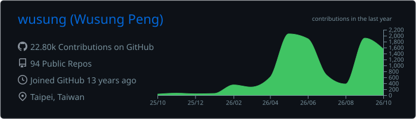

## Wusung Peng

Software engineer in Taipei. On GitHub since 2013 — started in C# / Java enterprise systems, now mostly Go, Rust and infrastructure.

I build the tooling that lets AI coding agents do real work end to end: from a request in a chat room, to an approved agent run, to a reviewed PR, to a running deployment.

### Building now

- **[0ops](https://github.com/wusung/0ops)** (Go) — the `ship` verb missing from an AI agent's toolbelt. Claude Code / Codex write the code; one prompt takes the repo to a running app on your own domain.
- **mmflow** (Rust, private) — turns Mattermost / LINE / GitHub discussions into issues, approval-gated agent runs, and PRs reviewed back in the same thread.
- **patchbay** (PowerShell, private; installer: [pbayd-agent](https://github.com/wusung/pbayd-agent)) — command, file and tunnel bridge to locked-down Windows jump hosts over clipboard, git, OneDrive and RDP carriers.

### How I work with agents

- Agents write, humans approve: every run is gated by explicit approval and lands as a reviewable PR.
- Spec before code. Non-trivial changes go through adversarial multi-agent review — correctness, spec drift, security, and an executable e2e check — before release.
- Repeatable work is packaged as agent skills: auth, GitOps CD, jump-host operations, VM-based system testing.

### Stack

**Languages** Go · Rust · C# · Java · TypeScript · Python · PowerShell 
**Infra** Kubernetes · Terraform · GitOps · GitHub Actions · Cloudflare · OpenBao 
**Desktop** Linux (CachyOS, Sway, [tmux](https://github.com/wusung/tmux-compass)) · Windows

### Activity

 

---

Open to collaboration on AI-agent tooling and DevOps automation · [Buy me a coffee](https://paypal.me/warp941)
